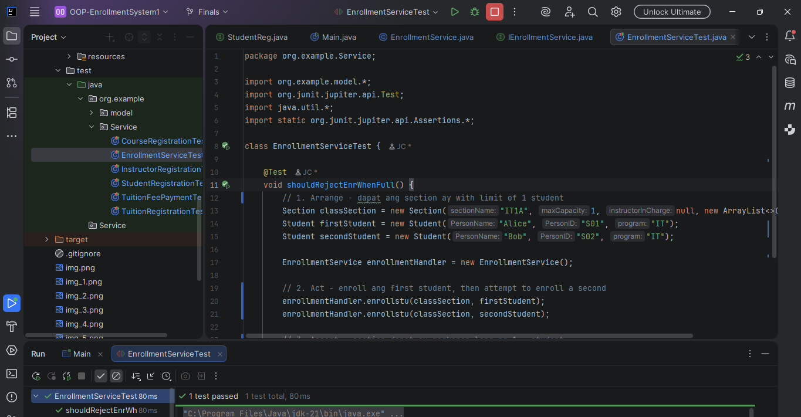
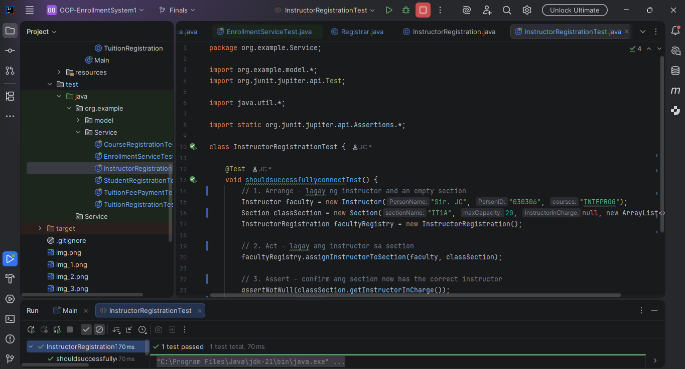
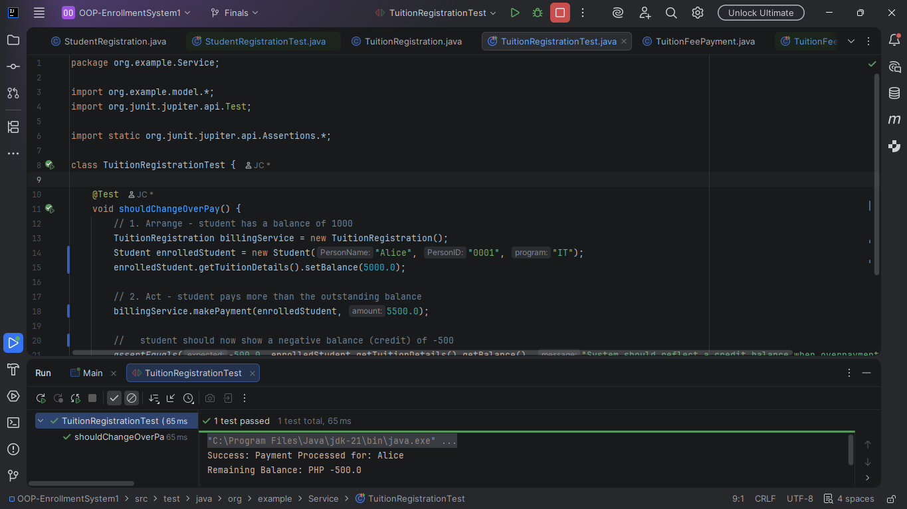
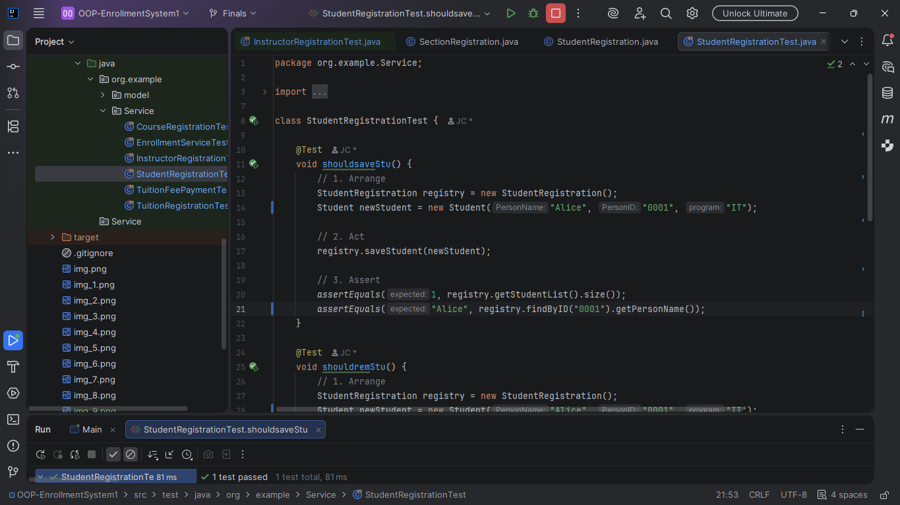
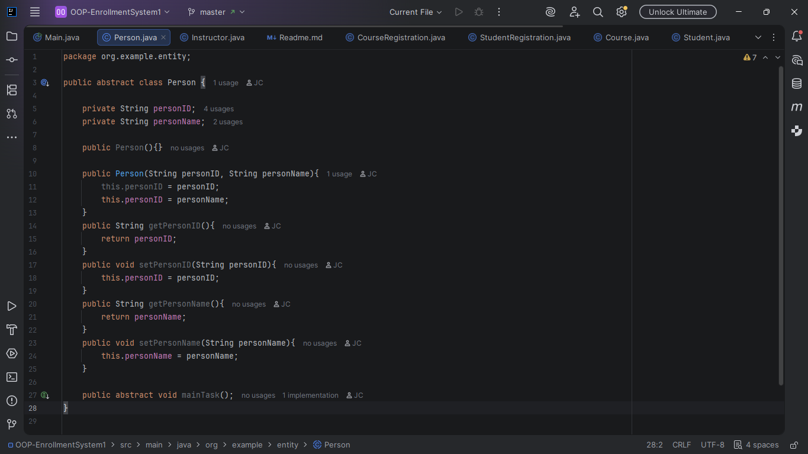
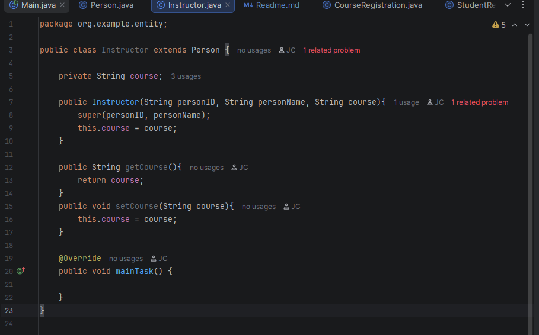
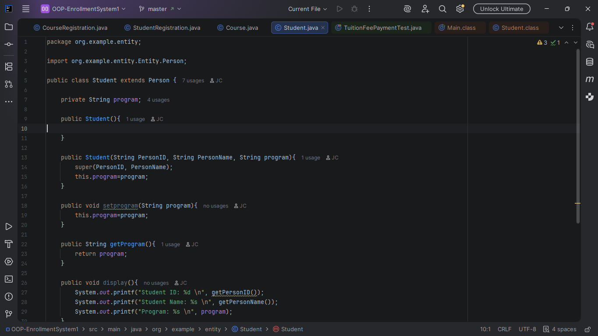

# OOP ENROLLMENT SYSTEM

---

**Author:** John Clarenze Rosedo
**Subject:** Integrative Programming - OOP Enrollment System (Final Output)

---
## Final Project Description
This project is a School Management System built with Java. It’s designed to handle everything a school needs—managing 
students, teachers, classes, and money—using a professional "contract-based" coding style.

## Main Features 
* Organized Folders: Keeps the "Data" (like student names) separate from the "Actions" (like enrolling a student) so the code stays clean.

* Smart Enrollment: The system knows when a classroom is full. If you try to add a 31st student to a 30-seat room, it will say "No."

* Balance Tracker: Calculates tuition fees, accepts payments, and shows how much a student still owes.

* School Tree View: You can look at a Department (like IT) and see exactly which teachers are in which sections and which students are in their seats.

* Safe Saving: Uses "Commits" (save points) so no work is ever lost during development.

---
## How does it Work?Step 1

### You select [1] Registrar Operations, then [1] Save Student.
Then it will ask you to Put Student Full Name, Student ID#, Program, 
### Then [10] to create a Department like (ceas), (cite), etc
### Then Select [11] to create a Course Ex: INTEPROG
### [14] to see courses
### then [15] to go back to dashboard

### Step 2 is select [2] to go to HR portal
### Type [1] to hire a faculty member then ask you to enter ID#, Name of Prof then it will connect to the course you made earlier.

### Step 3 is to make a Section using [5] name it anything you want (V1A)

#### Last step is to check if the student have a tuition fee balance and check if all your made subjects, students, teacher, sections is still there.
### ------------------------------------------------------------------------------------------------------------------------------------------------------------------------------------

## JUnit 5 TESTING FOR BUSINESS LOGIC (bonus)

## 1. Updates course automatically if updated  

## 2. Shows how many students can be enrolled 

## 3. Assign a Prof and works 

## 4. Pays a tuition and have an excess and records it as -500 

## 5. Two students cant have the same ID# 

---

---

# INHERITANCE the first push in github

Instructor Class 

Student

Course

CourseRegistration

StudentRegistration

Person

Instructor

Student
